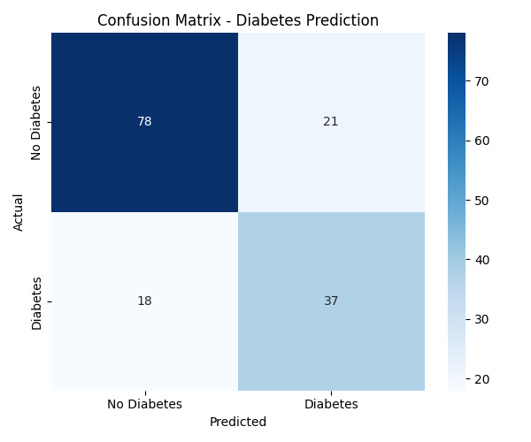
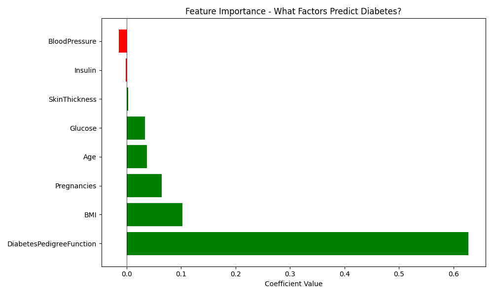
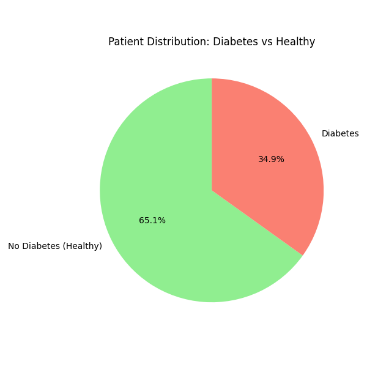
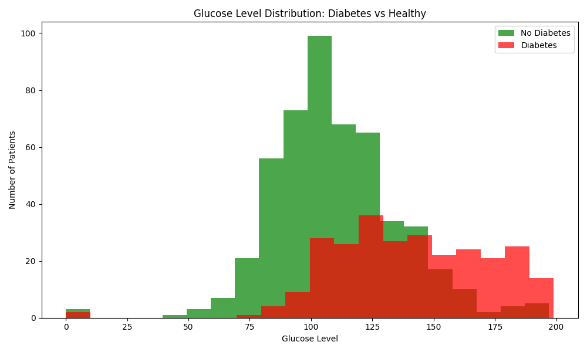

# Disease Prediction Model — Diabetes

Machine Learning model that predicts diabetes with 74.68% accuracy using patient medical data.

**By Padma Shree** | First ML Project | Project 8 of 25

---

## The Problem

Diabetes affects millions of Indians. Early detection saves lives. But most people do not know their risk until it is too late.

---

## What I Built

A Logistic Regression model that predicts diabetes based on:
- Number of pregnancies
- Glucose level
- Blood pressure
- BMI
- Age
- Family history (Diabetes Pedigree Function)

---

## Results

| Metric | Value |
|--------|-------|
| Accuracy | 74.68% |
| Patients analyzed | 768 |
| Training data | 614 patients |
| Testing data | 154 patients |

---

## 📊 Charts

### 1. Confusion Matrix — How the model performed


### 2. Feature Importance — What factors matter most


### 3. Patient Distribution — Diabetes vs Healthy


### 4. Glucose Level Analysis — Diabetes patients have higher glucose


---

## Most Important Factors

1. **Diabetes Pedigree Function** (Family history) — Most important
2. **BMI** (Obesity) — Second most important
3. **Pregnancies** — Third most important

---

## Tech Stack

- Python
- Pandas, NumPy
- Scikit-learn (Logistic Regression)
- Matplotlib, Seaborn (Visualizations)

---

## How to Run

```bash
pip install pandas scikit-learn matplotlib seaborn
python disease_model.py
